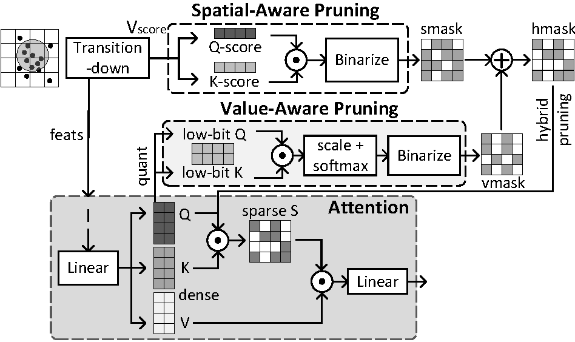

Point Cloud Transformer is undergoing a rising trend in both industry and academia. It aligns traditional point cloud feature extraction methods with the latest transformer architecture and achieves remarkable performance. However, accelerators for traditional point cloud neural networks (PCNNs) and those solely for transformers fail to capture the characteristics of point cloud transformers, thus exhibiting poor performance. To address this challenge, we propose Sava, a co-designed accelerator that adopts a spatial- and value-aware hybrid pruning strategy for point cloud transformers. In terms of the spatial domain, we observe that points in regions of various densities exhibit different levels of importance. In the value space, a minor input contributes less to features, indicating lower importance. Considering both perspectives, we hybridize the information inherited from the spatial and value spaces to prune less significant values in attention, which converts data to sparse patterns and makes it readily accelerated. Furthermore, we adopt low-bit quantization to boost computations and apply varying quantization precisions across different network layers based on their sensitivity. In support of our algorithm, we propose an architecture that employs a configurable mixed-precision systolic array for various computing loads under diverse precisions. To address the workload imbalance of the unstructured sparse computations, we introduce a data rearrangement mechanism, which improves resource utilization while hiding latency. We evaluate our Sava on four point cloud transformer models and achieve notable accuracy and performance gains. In comparison with CPU, GPUs, and ASICs, our Sava offers 10.3x, 3.6x, 3.3x, 2.6x, 2.2x speedup, along with 20x, 8.8x, 6.9x, 3.2x, 2.4x energy savings on average.

Authors: **Xueyuan Liu**, Zhuoran Song, Xiang Liao, Xing Li, Tao Yang, Fangxin Liu and Xiaoyao Liang

* Accepted by Design, Automation, and Test in Europe (DATE 2024)
* [paper]() (coming soon...)
* [slide](https://jbox.sjtu.edu.cn:10081/v2%2Fdelivery%2Fdata%2F8ec8d6dba3e34fa78b945cd388f4f4a7%2F?)
* [poster](https://jbox.sjtu.edu.cn:10081/v2%2Fdelivery%2Fdata%2F1b4bb9caa4504fceb4d5eeafa0edeb8a%2F?)
* [cite]() (coming soon...)